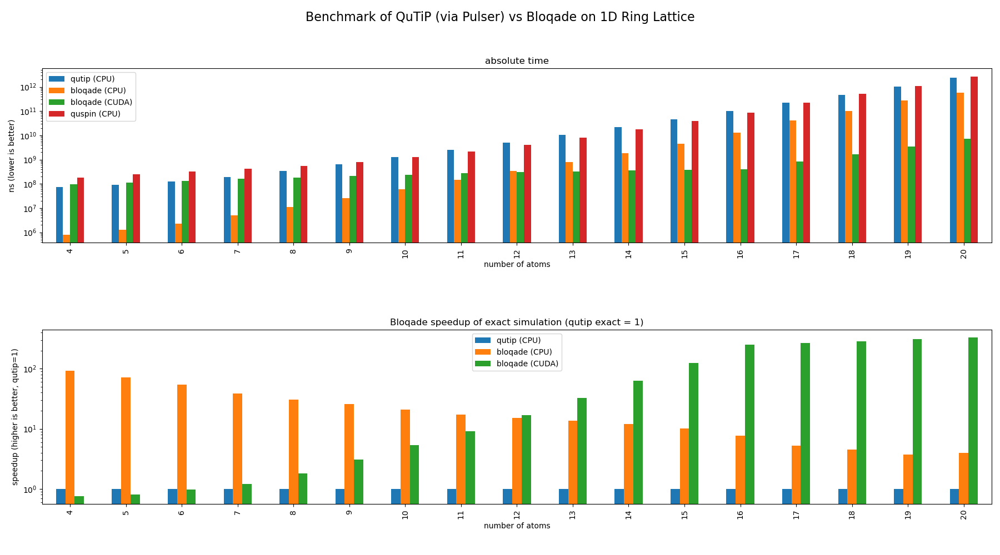
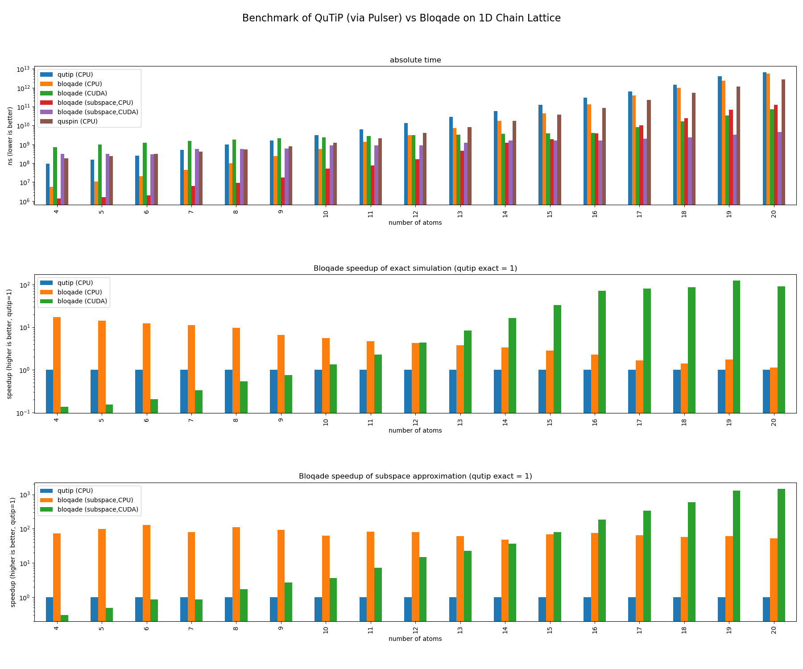

# Benchmark of Bloqade

### Platform Info

CPU & System:

```sh
Platform Info:
  OS: Linux (x86_64-pc-linux-gnu)
  CPU: Intel(R) Xeon(R) CPU E5-2686 v4 @ 2.30GHz
  WORD_SIZE: 64
  LIBM: libopenlibm
  LLVM: libLLVM-12.0.1 (ORCJIT, broadwell)
```

CUDA:

```
Unknown NVIDIA driver, for CUDA 11.6
CUDA driver 11.6

Libraries: 
- CUBLAS: 11.8.1
- CURAND: 10.2.9
- CUFFT: 10.7.0
- CUSOLVER: 11.3.2
- CUSPARSE: 11.7.1
- CUPTI: 16.0.0
- NVML: missing
- CUDNN: 8.30.2 (for CUDA 11.5.0)
- CUTENSOR: 1.4.0 (for CUDA 11.5.0)

Toolchain:
- Julia: 1.7.3
- LLVM: 12.0.1
- PTX ISA support: 3.2, 4.0, 4.1, 4.2, 4.3, 5.0, 6.0, 6.1, 6.3, 6.4, 6.5, 7.0
- Device capability support: sm_35, sm_37, sm_50, sm_52, sm_53, sm_60, sm_61, sm_62, sm_70, sm_72, sm_75, sm_80

0: Tesla V100-SXM2-16GB (sm_70, 15.483 GiB / 15.782 GiB available)
```

### Package Specifications and Evnironments

#### Environment Variables

```
export OMP_NUM_THREADS=1
export MKL_NUM_THREADS=1
export MKL_DOMAIN_NUM_THREADS=1
export JULIA_NUM_THREADS=1
```

#### Bloqade:

Dependencies:
- Bloqade.jl: v0.1.5

For more detailed dependencies, please refer to [Manifest.toml](bloqade/Manifest.toml).

#### QuTiP/Pulser:

Dependencies:
- pulser: 0.6.0
- qutip: 4.7.0
- numpy: 1.21.5
- scipy: 1.8.0

### Results




